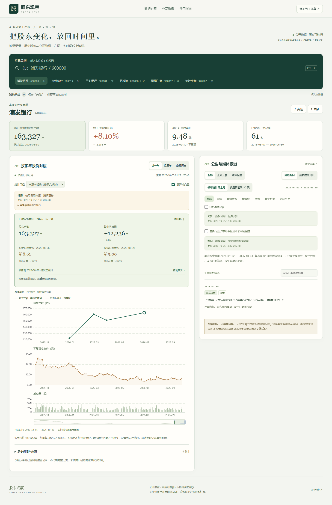
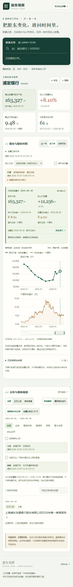

# 股东观察 · Stock Lens

[](https://github.com/user0928/stock-lens/actions/workflows/ci.yml)
[](LICENSE)

把 A 股股东户数、历史股价和公司资讯放回同一条时间线。手机优先，支持电脑研究、浏览器关注列表和 PWA。React + ECharts / Python FastAPI / SQLite。

**A mobile-first, self-hosted A-share research tool: historical shareholder counts, unadjusted daily prices and traceable announcements/news.** No paid API or AI service is required. The UI is in Chinese. Run locally or use Docker with a persistent data volume.

> 仓库提供完整可运行源码，GitHub 仓库页面不是在线查询服务。查询数据需要同时运行 Python 后台；GitHub Pages 只能托管静态网页，不能运行此后台。



## 能做什么

- 输入沪深北 A 股名称或代码；支持方向键选择、Enter 确认、`Ctrl K` 快速搜索。
- 股东户数和不复权股价上下对齐，共用时间轴；人数纵坐标与图内卡片均显示具体数值。
- 点击披露点查看户数、增减、变化率、统计截止日、披露日，以及两种日期对应的收盘价和来源。
- 鼠标拖动/手机横滑平移，长按后拖动查看读数；纵向滑动仍可滚动网页。拖动不产生连续资讯查询。
- 展开成交量、使用底部滑块缩放、从明细表精确选点或导出 CSV。
- 正式公告/媒体报道分别标注；区分所选历史期间和最新资讯，可筛选分类与标题。
- 关注列表保存在当前浏览器。后台按匿名浏览器订阅维护更新，访客之间不覆盖；无账户或跨设备同步。

<details>
<summary>手机界面</summary>



</details>

## 快速开始

### Docker（跨平台）

需要 Docker Engine / Docker Desktop 和 Compose。克隆后运行：

```sh
git clone https://github.com/user0928/stock-lens.git
cd stock-lens
docker compose up --build -d
```

打开 **http://127.0.0.1:8765/**。首次查询会从公开来源获取数据，等待时会显示采集状态。

```sh
docker compose logs -f
# 停止，保留数据卷
docker compose down
```

数据保存在 `stock-lens-data` 命名卷。重新构建和正常停止不会删除缓存。默认端口只绑定本机。

### Windows / PowerShell

先准备 Python **3.11+** 和 Node.js **20.19+ / 22.12+**，在项目目录运行：

```powershell
./Setup.ps1
./Start.ps1
# 停止本项目服务
./Stop.ps1
```

若系统阻止执行脚本，可仅在当前终端使用 `Set-ExecutionPolicy -Scope Process Bypass`，再执行上述步骤；不需修改全局策略。脚本会检查已有工具，在本项目创建 `.venv`、安装依赖、构建网页。日志在 `data/server.log` / `data/server-error.log`。

### macOS / Linux

Python 3.11+ 和 Node.js 20.19+ / 22.12+：

```sh
sh setup.sh
sh start.sh
```

打开同一地址；`Ctrl C` 停止。Linux 如缺少 venv 模块，先通过系统包管理器安装对应的 Python venv 包。

### 手动运行 / 开发

```sh
python -m venv .venv
# 先激活 .venv，再运行
python -m pip install -r requirements-lock.txt
npm ci
npm run build
python -m uvicorn backend.app:app --host 127.0.0.1 --port 8765
```

前端开发可另开终端 `npm run dev`；Vite 将 `/api` 代理到 8765。后端 API 文档在 `/docs`。

## 手机与在线使用

- **同一 Wi-Fi**：Windows `./Start.ps1 -Lan`；Linux/macOS `HOST=0.0.0.0 sh start.sh`。手机访问 `http://电脑IPv4:8765/`。手机上的 `127.0.0.1` 指手机自身，不能访问电脑。防火墙或 Wi-Fi 隔离可能需要自行配置。
- **添加到主屏幕**：通过浏览器菜单安装。完整 PWA 能力需 HTTPS 或本机 localhost，普通局域网 HTTP 可以浏览。
- **异地访问**：需要持续在线的 Python 后台和持久存储。可自行部署 Docker 并在前面配置 HTTPS 反向代理。源站接口可能限流，当前应用是轻量研究工具，尚未进行大规模负载测试。
- 反向代理应保留 Host，将转发头仅交给可信代理。使用 `FORWARDED_ALLOW_IPS` 指定代理 IP，避免全网信任转发头；否则 HTTPS 下同源检查可能不匹配。
- 单进程/单实例运行。SQLite 缓存、请求节流与任务去重均按此模式设计；不要直接增加多个 Uvicorn workers。

公开仓库不包含本机数据库、日志、关注列表、Cookie、账号凭据或第三方网页全文。每个安装实例自行取得数据。没有部署收费托管或购买接口。

## 数据从哪里来

| 内容 | 来源 | 口径与边界 |
|---|---|---|
| 股票名称 / 代码 | 东方财富公开搜索 | 失败时仅显示缓存公司；北交所支持当前 920 开头及来源识别的旧代码 |
| 股东户数 | 东方财富公开数据 | 分页获取来源返回的历史；原接口未明确口径的记录标为待核对 |
| 报告原文核验 | 巨潮公司报告 | 已保留六只样本、18个历史数据点的原文地址、页码与摘录 |
| 正式公告 | 巨潮优先、东方财富备用 | 主来源冷却/失败时尝试备用，公告转载明确标注 |
| 不复权日行情 | 东方财富候选、腾讯备用 | 保存开高低收、来源、获取时间；成交量由手换算为股 |
| 媒体新闻 | 东方财富新闻检索 | 每次最多100条候选，显示实际覆盖日期、媒体名称和转载链接 |

**缺口不会被补成零或演示数据。** 北交所历史行情目前仍有缺口，零星最新记录不等于完整历史。沪深样本12个统计日价格已跨来源一致核对，见[第二版验证报告](validation/第二版验证报告.md)。免费公开接口可能调整、限流或失效；此应用不能保证来源完整性、长时间在线可用或新闻覆盖完整历史。

统计截止日与披露日分别保存。没有当日行情时明确列出最近此前交易记录的真实日期，不能把它当作当天价格。不同股东口径不混合；同日冲突保留且中断连线、变化率。仅连接披露点，无法推算每日人数。

报道按平台标注发布时间筛选；转载时间不作为事件发生日期。数字代码可能是股数，相关性检查结合公司名、历史可靠名称或证券标识。新闻摘要是原始摘录，未使用付费 AI。图表时间接近不代表因果关系，不生成买卖建议。

明确登录要求会提供原站入口，由用户在原站阅读；验证码、403、504分别呈现。应用不读取浏览器密码或将原站登录状态复制给后台。未接入同花顺。

## 缓存与运行方式

- SQLite 默认 `data/stock-lens.sqlite`；设置 `STOCK_LENS_DATA_DIR` 可更改整个数据目录，`STOCK_LENS_DB` 可单独指定数据库。
- 增量建表；不重建已有股东库。原文核验来自 `validation/audit.json`，是可公开的披露证据，不是个人数据库。
- 股东数据24小时、媒体6小时检查过期；公告按所选区间补取。关注股票运行时每小时检查是否需要更新，停机期间不更新。
- 匿名后台订阅30天有效，页面打开时续期；取消关注仅影响自己的订阅。Cookie 为 HttpOnly/SameSite=Lax，关注名称和展示列表仍仅在本浏览器。
- 限制3个上游并发、最多48个排队采集任务；默认每IP每分钟180个 API 请求，超出返回429与重试间隔。搜索缓存5分钟。
- 页面暂时连接失败时保留已加载记录，刷新保持当前选点；切换股票立即清除旧股票数据。
- PWA 仅缓存页面资源，API 不由 Service Worker 缓存；离线不能保证历史查询可用。

## 接口

| 方法与路径 | 作用 |
|---|---|
| `GET /api/search?q=名称或代码` | 搜索沪深北公司 |
| `GET /api/stocks/{code}` | 股东历史、统计口径、核验标记、更新状态 |
| `GET /api/stocks/{code}/prices?start=YYYY-MM-DD&end=YYYY-MM-DD` | 不复权日行情、缓存与缺口 |
| `GET /api/stocks/{code}/events?start=YYYY-MM-DD&end=YYYY-MM-DD` | 公告区间、主/备用来源状态 |
| `GET /api/stocks/{code}/news?mode=period&start=YYYY-MM-DD&end=YYYY-MM-DD` | 同期报道；`mode=latest` 查看最新 |
| `POST /api/stocks/{code}/refresh` | 请求更新股东记录 |
| `POST /api/stocks/{code}/prices/refresh?start=...&end=...` | 请求更新行情 |
| `POST /api/stocks/{code}/events/refresh?start=...&end=...` | 请求更新公告 |
| `POST /api/stocks/{code}/news/refresh` | 请求更新媒体报道 |
| `PUT /api/watchlist` | 当前浏览器订阅，JSON `{"codes":["600000"]}`，最多100只 |
| `GET /api/health` | 运行状态与北京时间 |

刷新有30秒节流。首次查询先返回缓存或空结果，`status.refreshing` 表示后台正在取得数据，可间隔轮询；失败与空结果分别标注。

## 验证与贡献

```sh
python -m pytest -q -p no:cacheprovider
npm test
npm run build
# 有界的联网样本检查，不能把 candidate_match 自动改为 verified
python validate_sources.py
python validate_v2.py
```

[公开版检查报告](validation/公开版检查报告.md)记录后端回归、实际 Edge 桌面与手机模拟交互、构建及公开发布结果。实体手机、Linux脚本人工实测与大规模并发尚未完成；CI 验证 Linux 后端/前端和干净 Docker 安装。欢迎在 Issues 中提供代码、日期、来源链接和复现步骤，避免上传账号或个人浏览器数据。

代码采用 [MIT](LICENSE)。第三方公告、行情和新闻仍归其原权利人及来源规则管理，MIT 不授予这些数据的再分发权利。
